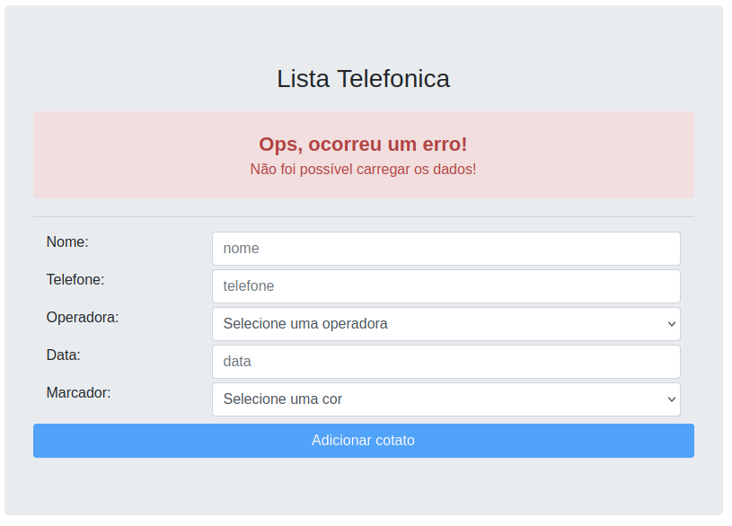
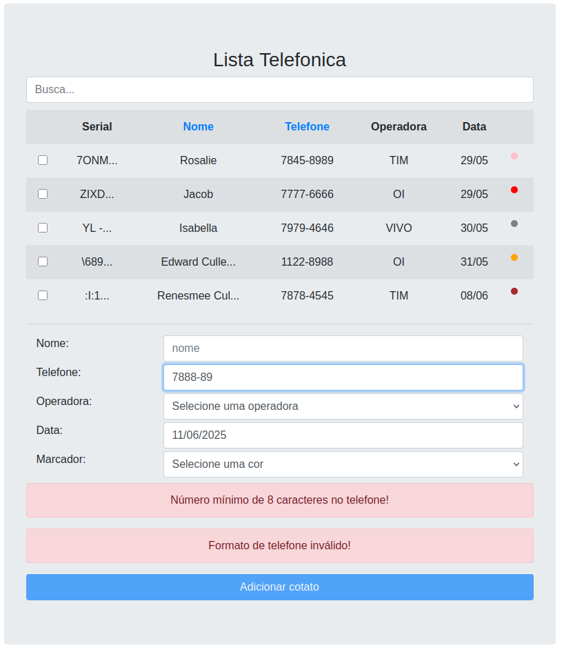
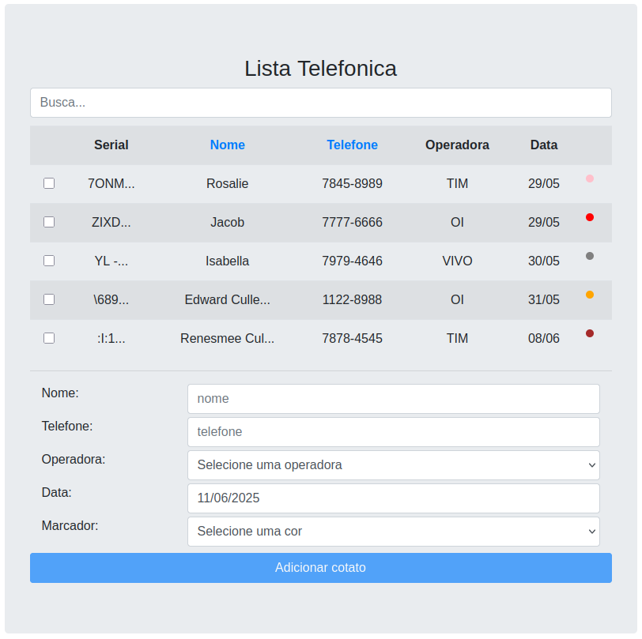
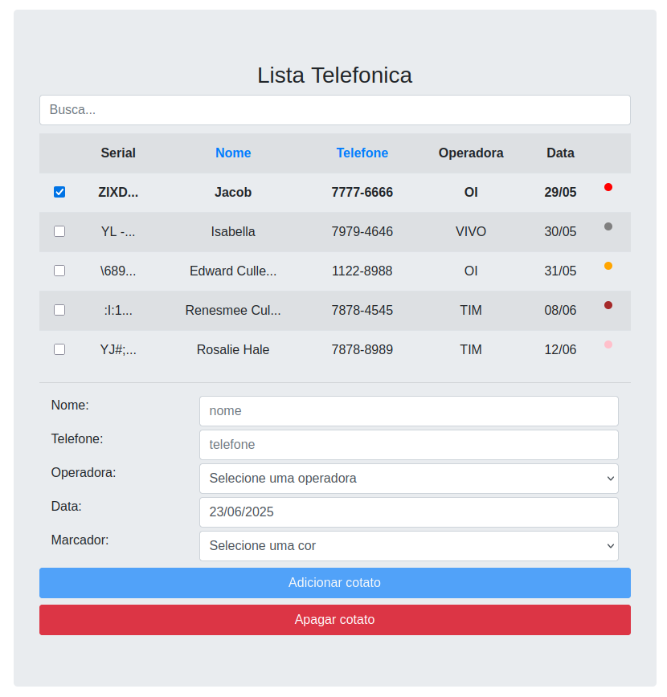

# AngularJs
- Criando uma lista telefônica com **AngualarJs** e **Bootstrap**

- Seguindo o curso de AngularJs do Rodrigo Branas []( https://www.youtube.com/@RodrigoBranas/featured)


##
### Algumas das principais diretivas que utilizamos:
ng-app, ng-controller, ng-model, ng-click, ng-repeat, ng-disabled, ng-options, ng-class, ng-style, ng-show, ng-if, ng-required, ng-minlength, ng-pattern
$pristine, $dirty, $error

**Serviços:**
Factory, Service, Value, Provider, Config

**Filtros:**
uppercase, date, filter, orderBy, currency

**Diretivas:**
directive, replace, restrict, scope, transclude

**Interceptors**

##
Angular-route

**Integração com o Back-end**
GET, POST, DELETE

<hr/>

### JSON Server (API Fake)
1. Instale o JSON Server
```
npm install -g json-server
```

2. Acesse a pasta ./data, onde está o arquivo db.json

3. Inicie o JSON Server
```
json-server --watch db.json --port 3000
```

<hr/>









<hr/>
<div style="display: inline_block">
  
  
  
  
  
</div>
